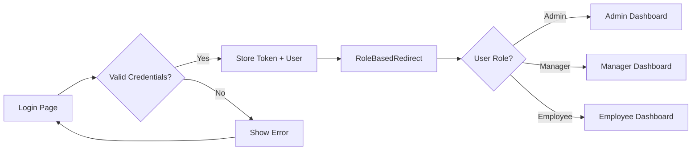

# 🚀 StaffSync - Employee TimeCard Frontend

A modern, responsive React-based frontend application for employee time tracking, task management, and leave requests with role-based dashboards for employees, managers, and administrators.

## 📋 Table of Contents
- [Features](#features)
- [Tech Stack](#tech-stack)
- [Project Structure](#project-structure)
- [Getting Started](#getting-started)
- [Available Scripts](#available-scripts)
- [User Roles & Permissions](#user-roles--permissions)
- [Key Features by Role](#key-features-by-role)
- [Environment Variables](#environment-variables)
- [Contributing](#contributing)

## ✨ Features

### 🔐 Authentication & Authorization
- JWT-based authentication with token persistence
- Role-based access control (Admin, Manager, Employee)
- Automatic role-based dashboard redirects
- Protected routes with authorization guards

### 👤 Employee Features
- **Dashboard**: Quick actions for clock in/out, view tasks, and attendance summary
- **Timecard History**: View and export timecard records with custom date ranges
- **Leave Management**: Submit and track leave requests (vacation, sick, personal)
- **Task Management**: View assigned tasks with status tracking and priority levels
- **Profile Management**: Update personal information and change password

### 👔 Manager Features
- **Manager Dashboard**: Overview of team performance and pending approvals
- **Employee Status**: View detailed employee information and timecard history
- **Leave Approval**: Review and approve/reject team leave requests
- **Team Attendance**: Monitor team timecard records with date range filtering
- **Excel Export**: Download employee timecard reports in Excel format

### 🔧 Admin Features
- **Admin Dashboard**: System-wide statistics with colorful gradient cards
- **User Management**: View all users with role badges and employee details
- **Role Management**: Promote/demote users between employee, manager, and admin roles
- **Employee CRUD**: Add new employees and delete existing users
- **Department Analytics**: Track department count and user distribution

## 🛠️ Tech Stack

### Core
- **React 18.3.1** - UI library
- **TypeScript 5.5.3** - Type safety
- **Vite 5.4.10** - Build tool and dev server

### State Management
- **Redux Toolkit 2.3.0** - Global state management
- **React Redux 9.1.2** - React bindings for Redux

### UI & Styling
- **Material-UI (MUI) 6.1.6** - Component library
- **SCSS** - Styling with BEM naming convention
- **Material Icons** - Icon library
- **Date-fns 4.1.0** - Date manipulation

### Routing & Forms
- **React Router DOM 6.27.0** - Client-side routing
- **MUI X Date Pickers 7.20.1** - Date/time pickers

### Data & API
- **Axios 1.7.7** - HTTP client
- **XLSX 0.18.5** - Excel export functionality

## 📁 Project Structure

```
Employee-frontend/
├── src/
│   ├── components/              # Reusable components
│   │   ├── DashboardLayout.tsx  # Main layout with sidebar
│   │   ├── ProtectedRoute.tsx   # Auth & role guard
│   │   ├── RoleBasedRedirect.tsx # Auto redirect by role
│   │   └── styles/
│   │
│   ├── pages/                   # Page components
│   │   ├── admin/              # Admin-only pages
│   │   │   ├── AdminDashboard.tsx
│   │   │   └── styles/
│   │   ├── manager/            # Manager-only pages
│   │   │   ├── ManagerDashboard.tsx
│   │   │   ├── EmployeeStatusPage.tsx
│   │   │   ├── LeaveApprovalPage.tsx
│   │   │   ├── TeamAttendanceScreen.tsx
│   │   │   └── styles/
│   │   ├── employee/           # Employee pages
│   │   │   ├── EmployeeDashboard.tsx
│   │   │   ├── LeaveRequestScreen.tsx
│   │   │   ├── ProfilePage.tsx
│   │   │   ├── TaskManagementScreen.tsx
│   │   │   ├── TimecardHistory.tsx
│   │   │   └── styles/
│   │   ├── common/             # Shared pages
│   │   │   ├── LoginPage.tsx
│   │   │   └── styles/
│   │   └── styles/             # Shared styles
│   │
│   ├── features/               # Redux slices
│   │   ├── store.ts           # Redux store configuration
│   │   └── auth/
│   │       └── authSlice.ts   # Auth state management
│   │
│   ├── hooks/                 # Custom hooks
│   │   └── useAuth.ts        # Authentication hook
│   │
│   ├── services/             # API services
│   │   ├── api.ts           # Main API configuration
│   │   └── authApi.ts       # Auth API endpoints
│   │
│   ├── types/               # TypeScript type definitions
│   │   └── index.ts        # Shared types
│   │
│   ├── styles/             # Global styles
│   │   ├── _variables.scss # SCSS variables
│   │   └── _base.scss     # Base styles
│   │
│   ├── App.tsx            # Main app component with routing
│   ├── main.tsx          # App entry point
│   └── index.css        # Global CSS
│
├── public/              # Static assets
├── .env                # Environment variables
├── vite.config.ts     # Vite configuration
├── tsconfig.json      # TypeScript configuration
└── package.json       # Dependencies and scripts
```

## React Compiler

The React Compiler is not enabled on this template because of its impact on dev & build performances. To add it, see [this documentation](https://react.dev/learn/react-compiler/installation).

## 🚀 Getting Started

### Prerequisites
- Node.js (v16 or higher)
- npm or yarn
- Backend server running (Employee-Backend)

### Installation

1. **Clone the repository**
   ```bash
   git clone <repository-url>
   cd Employee-frontend
   ```

2. **Install dependencies**
   ```bash
   npm install
   ```

3. **Configure environment variables**
   
   Create a `.env` file in the root directory:
   ```env
   VITE_API_URL=http://localhost:5000
   ```

4. **Start the development server**
   ```bash
   npm run dev
   ```

5. **Open in browser**
   
   Navigate to `http://localhost:5173`

### Default Login Credentials

After backend database initialization:
- **Admin**: Use credentials from database
- **Manager**: Use credentials from database  
- **Employee**: Use credentials from database

## 📜 Available Scripts

```bash
# Start development server with HMR
npm run dev

# Build for production
npm run build

# Preview production build
npm run preview

# Lint code with ESLint
npm run lint
```

## 👥 User Roles & Permissions

### 🔴 Admin (Highest Level)
- Full system access
- User management (add, delete, role changes)
- View all employee data
- Access to system analytics

### 🟡 Manager
- Team management capabilities
- Approve/reject leave requests
- View team timecard records
- Export team reports
- Monitor employee status

### 🟢 Employee
- Personal timecard management
- Submit leave requests
- View and update assigned tasks
- Manage personal profile
- View attendance history

## 🎯 Key Features by Role

### Admin Dashboard
```typescript
// Features:
- System Statistics (gradient cards)
  • Total Users count
  • Total Departments count
  • Total Managers count
  • Total Employees count

- User Management Table
  • View all users with role badges
  • Employee ID, name, email, department, position
  • Change user roles (promote/demote)
  • Add new employees with full details
  • Delete existing employees (with cascading delete)
```

### Manager Dashboard
```typescript
// Features:
- Quick Actions
  • View Employee Status
  • Approve Leave Requests
  • View Team Attendance

- Team Overview
  • Pending leave requests count
  • Team members with attendance status
  • Recent team activity
  
- Export Capabilities
  • Download timecard reports as Excel
  • Custom date range selection
```

### Employee Dashboard
```typescript
// Features:
- Quick Actions
  • Clock In/Out
  • Request Leave
  • View Tasks
  
- Attendance Summary
  • Current week overview
  • Monthly statistics
  • Year-to-date totals
  
- Task Management
  • View assigned tasks
  • Update task status
  • Priority-based filtering
```

## 🔌 API Integration

### Base Configuration
```typescript
// src/services/api.ts
const API_BASE_URL = import.meta.env.VITE_API_URL || 'http://localhost:5000';

// Automatic JWT token injection
axios.interceptors.request.use((config) => {
  const token = localStorage.getItem('token');
  if (token) {
    config.headers.Authorization = `Bearer ${token}`;
  }
  return config;
});
```

### Available API Services
- **authApi**: Login, logout, token validation
- **timecardApi**: Clock in/out, timecard history, export
- **leaveApi**: Submit requests, view status, approve/reject
- **taskApi**: Fetch tasks, update status, create tasks
- **managerApi**: Team data, employee status, reports

## 🔐 Authentication Flow



### Protected Route Logic
```typescript
// All routes use ProtectedRoute component
<ProtectedRoute requiredRole="admin">
  <AdminDashboard />
</ProtectedRoute>

// Checks:
1. User is authenticated (has token)
2. User has required role (if specified)
3. Redirects to login if check fails
```

## 🎨 Styling Architecture

### SCSS Structure
- **BEM Naming Convention**: `.block__element--modifier`
- **SCSS Variables**: Colors, spacing, breakpoints in `_variables.scss`
- **Component-Specific Styles**: Each page has dedicated `.scss` file
- **Gradient Cards**: Custom gradient backgrounds for statistics

### Example Component Style
```scss
// AdminDashboard.scss
.admin-dashboard {
  padding: 24px;
  
  &__header {
    margin-bottom: 24px;
  }
  
  &__stats-grid {
    display: grid;
    grid-template-columns: repeat(auto-fit, minmax(250px, 1fr));
    gap: 20px;
  }
  
  &__stat-card {
    background: linear-gradient(135deg, #667eea 0%, #764ba2 100%);
    
    &--users {
      background: linear-gradient(135deg, #f093fb 0%, #f5576c 100%);
    }
  }
}
```

## 🧩 Key Components

### DashboardLayout
- Main application layout
- Collapsible sidebar navigation
- Role-based menu items
- User profile display
- Responsive design (mobile drawer)

### ProtectedRoute
- Authentication guard
- Optional role requirement
- Redirect to login if unauthorized
- Used on all authenticated routes

### RoleBasedRedirect
- Automatic dashboard routing
- Based on user role in Redux state
- Used on root `/` route

## 🗄️ State Management

### Redux Store Structure
```typescript
// features/store.ts
{
  auth: {
    user: {
      id: number,
      email: string,
      role: 'admin' | 'manager' | 'employee',
      firstName: string,
      lastName: string,
      employeeId: string
    } | null,
    token: string | null,
    isAuthenticated: boolean
  }
}
```

### Auth Actions
```typescript
// features/auth/authSlice.ts
- setCredentials(user, token)  // On login success
- logout()                      // Clear auth state
- updateUser(userData)          // Update user info
```

## 🌐 Environment Variables

```env
# Required
VITE_API_URL=http://localhost:5000    # Backend API URL

# Optional
VITE_APP_NAME=StaffSync               # Application name
VITE_ENABLE_LOGS=true                 # Enable console logs
```

## 🤝 Contributing

### Code Style Guidelines
1. Use TypeScript for all new components
2. Follow BEM naming for SCSS classes
3. Keep components focused and single-responsibility
4. Use Redux for global state, local state for UI
5. Write descriptive commit messages

### Component Creation Template
```typescript
import React from 'react';
import { Box, Typography } from '@mui/material';
import './styles/ComponentName.scss';

interface ComponentNameProps {
  // Props definition
}

const ComponentName: React.FC<ComponentNameProps> = ({ }) => {
  return (
    <Box className="component-name">
      <Typography>Component Content</Typography>
    </Box>
  );
};

export default ComponentName;
```

## 📞 Support

For issues, questions, or contributions, please contact the development team or create an issue in the repository.

---

**Built with ❤️ using React + TypeScript + Material-UI**
